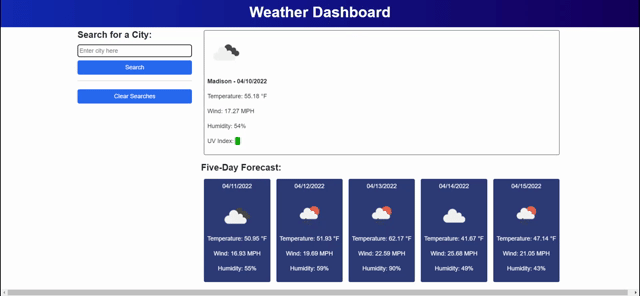

# Weather Dashboard

### Created by Carolyn Hudson

---

## Description:
This application allows users to see the weather outlook for multiple cities. When a city is searched, the user is presented with current and future conditions for that city and that city is added to the search history. Current weather conditions displayed include the city name, the date, an icon representation of the weather conditions, the temperature, humidity, wind speed, and UV index. The UV index is color-coded to indicate whether the conditions are favorable (green), moderate (yellow), or severe (red). The five-day forecast displays the date, weather icon, temperature, wind speed, and humidity. If the user clicks on a city saved in the search history, the current and future weather conditions for that city are displayed. 

---

## Preview:
The following GIF demonstrates the web application's appearance and functionality:

---

## Links:

* GitHub [Repository](https://github.com/cghudson/weather-dashboard)

* Deployed application [URL](https://cghudson.github.io/weather-dashboard/) 
